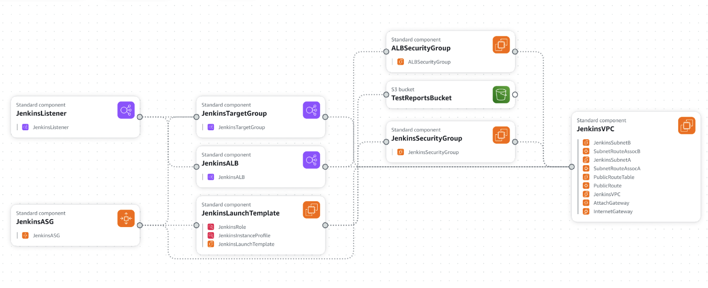

# Jenkins CI/CD with AWS and Behave BDD Test Automation

### Description:
This project demonstrates the setup of a scalable Jenkins CI/CD pipeline on AWS, utilizing an Auto Scaling Group (ASG), Application Load Balancer (ALB), and Docker containers. It showcases key AWS services like EC2, VPC, IAM, S3, and more, providing a robust and automated solution for continuous integration and delivery. The BDD code is a sample Behave project to test Jenkins intergration. It uses `requests` to hit an API and check if response is success.

### Cloudformation Template:

### Technologies Used:
* AWS (VPC, EC2, S3, IAM, Auto Scaling, ALB)
* Docker (for Jenkins container)
* CloudFormation (for infrastructure-as-code)
* Jenkins (for CI/CD)
* GitHub (for repository & version control)

### Features:
* Scalable Infrastructure: Jenkins is deployed inside an EC2 instance, with Auto Scaling for fault tolerance and high availability.
* Load Balancing: An Application Load Balancer (ALB) handles traffic distribution across multiple Jenkins instances.
* Dockerized Jenkins: Jenkins runs in a Docker container, ensuring easy setup and portability.
* Test Report Storage: Jenkins stores test results in an S3 bucket for easy access and reporting.
* IAM Role-based Access: Secure access and permissions are granted using IAM roles and policies.

### How It Works:
- Infrastructure Setup:
  - A CloudFormation template is used to automate the deployment of the entire infrastructure:
     - VPC, subnets, and routing.
     - EC2 instance running Docker with Jenkins.
     - ALB for load balancing.
     - Auto Scaling Group (ASG) to manage EC2 instances.
     - S3 bucket to store test reports.
- Jenkins in Docker:
  - Jenkins is installed in a Docker container on the EC2 instance, exposed on port 8080.
  - Jenkins persists its data through a Docker volume mounted on the EC2 instance at /jenkins_home.
- Scaling:
  - The Auto Scaling Group ensures that there is always one instance running, with the possibility to scale up to handle high traffic.
  - The ALB ensures that traffic is balanced across all instances.
- Future Improvements:
  - ECR Integration: For future scalability and better persistence management, Jenkins Docker images will be stored in Amazon ECR (Elastic Container Registry) instead of directly on EC2 instances.
  - EFS for Jenkins Persistence: Currently, Jenkins persists data in the EC2 host volume. In a production-ready scenario, using EFS (Elastic File System) would be better suited to provide persistent storage across Auto Scaling Groups.

### Deployment Steps:
1. Clone the repository.
2. Replace the `KeyName` parameter in the CloudFormation template with your EC2 key pair name.
3. Deploy the stack using AWS CloudFormation:
  - AWS Console: Upload the YAML template and follow the wizard.
  - AWS CLI:
    `aws cloudformation create-stack --stack-name jenkins-ci-cd --template-body file://your-template.yaml --parameters ParameterKey=KeyName,ParameterValue=your-keypair --capabilities CAPABILITY_NAMED_IAM`
4. Wait for the stack to finish creation. Once completed, access Jenkins using the provided ALB URL.
5. Configure Jenkins to pull your code and run the tests.

### Known Limitations::
- Persistence with ASG: Docker volumes do not persist across Auto Scaling Group lifecycle events. To address this:
  - Current Solution: Jenkins data is stored in the `/jenkins_home` volume on the EC2 instance.
  - Future Work: Plan to implement Amazon EFS for shared file storage across instances or use Amazon ECR for Jenkins container image management, improving persistence and scalability.

### Improvements for Future:
- Amazon EFS: Set up Amazon EFS for cross-instance persistent storage. This will solve the issue of volume persistence across EC2 instance reboots or Auto Scaling events.
- Containerized Jenkins on ECS or EKS: Deploy Jenkins in a containerized environment with ECS (Elastic Container Service) or EKS (Elastic Kubernetes Service) for more advanced scalability and management.
- CI/CD Pipeline: Add integration with AWS CodePipeline and CodeBuild to demonstrate end-to-end CI/CD automation on AWS.
